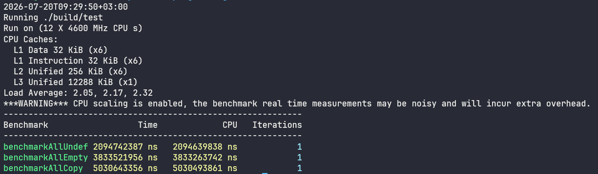

# TV-ITCH50-CPP
## Introduction
This is an ultra-low-latency, zero-copy parser for the [Nasdaq TotalView-ITCH 5.0 data feed](https://www.nasdaqtrader.com/content/technicalsupport/specifications/dataproducts/NQTVITCHSpecification.pdf): a proprietary data feed and protocol providing [Nasdaq](https://www.google.com/search?q=What+is+Nasdaq)'s full order depth using their ITCH format.

Since ITCH covers thousands of stocks listed across Nasdaq, many of which have a high market cap, a single day of ITCH data results in very large data files -- typically dozens of gigabytes. If you want to process this feed, you need high throughput (see benchmarks at end of README).

[Data samples here](https://emi.nasdaq.com/ITCH/Nasdaq%20ITCH/). For recent changes, [see here](devlog.md).

## Requirements
C++20 or above is required, with CMake 3.20 or above if you're using CMake. **This library has no third-party library requirements or even compiler extensions.** Support for both Windows and Linux. Should theoretically work on macOS, but no tests were done there.

## Build Instructions using CMake
Let's keep things simple and not have a headache with build systems. Suppose your project looks like:
```
your-project-folder
├─ main.cpp
├─ CMakeLists.txt
├─ ...
```

Open the terminal @ your project directory and clone this repo:
```
git clone https://github.com/aaa308-aub/tv-itch50-cpp
```

Build the parser easily as a static library in your CMake configuration; Your project's ``CMakeLists.txt`` should look something like this:
```cmake
cmake_minimum_required(VERSION 3.20) # CMake v. 3.20 or above is required
project(your-project-name)

set(CMAKE_CXX_STANDARD 20) # C++20 or above is required
set(CMAKE_CXX_STANDARD_REQUIRED ON)
set(CMAKE_CXX_EXTENSIONS OFF) # If you want

add_subdirectory(tv-itch50-cpp)

add_executable(your-project-name main.cpp)

target_link_libraries(your-project-name tv_itch50_cpp)

target_compile_options(your-project-name PRIVATE -O3)

# You can apply more compile options/optimizations like -march=native
# and -mtune=native, or something like --param=case-values-threshold=1
# for GCC to compile a switch statement as a jump table to add a
# small 50-100MB/s increase in throughput.
```

Build like normal:
```
cmake -S . -B your-build-folder -DCMAKE_BUILD_TYPE=Release
cmake --build your-build-folder
```

## Example on How to Use
```c++
#include "itch/parser.hpp"        // For itch::Parser class.
#include "itch/ios/ios.hpp"       // to_string() / std::ostream&<< methods.
#include "itch/spec/messages.hpp" // For message structs and viewers.

#include <iostream>
#include <string>

// Define a Handler struct/class. A basic example:
struct myHandler {
	int myVar = 0; // The handler doesn't have to be stateless.

	// For each message type, say "Xyz", the handler method must match
	// this signature exactly:
	// void onXyz( const itch::spec::view::XyzView v );
	// Example for AddOrder:
	void onAddOrder( const itch::spec::view::AddOrderView v ) {
		using namespace itch::ios;

		// Look at AddOrderView definition for field-parsing methods.
		myVar += v.shares();
		// Or copy the entire message in a struct using the unbox method.
		const auto msg = v.unbox();
		std::cout << msg << "\n";
		// The separator between fields during printing is comma by default,
		// but you can change it. For example, to separate with tab:
		std::cout << to_string(msg, '\t') << "\n";
	}

	// If you don't define the rest, the parser simply skips them.
};

int main() {
	using namespace itch::ios;

	// For filepath, use forward-slashes regardless of what OS you're on.
	// It's safer to use a full directory rather than relative.
	const std::string myPath = "C:/Users/abdal/Downloads/S.NASDAQ_ITCH50";
	myHandler h;
	// Pass both filepath and handler. Notice: the parser is a templated
	// class. It can accept any handler. The handler is passed by
	// reference, so it MUST outlive the parser.
	itch::Parser p( myPath, h );

	// Use .next method to iterate to the next message.
	while ( p.next() ) {
		p.callHandler(); // You must call handler explicitly.

		// You cannot see messages from here -- only your Handler can.

		// Checking EOF is not required, since .next returns false when
		// EOF is reached. But you can still do so anyway:
		if ( p.eof() ) break;
	}
}
```

## Benchmarks
Notice:
1. Benchmarks are done through the [Google benchmark library](https://github.com/google/benchmark). Benchmark script is copied in a text file saved in ``src/ignored/``, along with its ``CMakeLists``.
2. Sample size is 13 GB or about 423.3 million messages.
3. CPU is my own: ``Intel Core i7-8700 CPU @ 3.20GHz × 6``
4. A mock run is done before every benchmark to fill the page cache. We benchmark the actual throughput, not the disk or I/O. With a high-end NVMe SSD, the parser still won't be I/O-bound.
5. ``msg/s`` implies average message per second. The average message is 30.712 bytes long **including the 2-byte length field**.

``BenchmarkAllUndef (~6.2 GB/s or ~202M msg/s):`` Benchmark with an empty handler -- no dispatch at every message.\
``BenchmarkAllEmpty (~3.4 GB/s or ~111M msg/s):`` Benchmark with an empty handler but still dispatch (switch). This drop is not surprising; the parser's job in ``BenchmarkAllUndef`` is to just "walk" the file cache, so a switch is relatively expensive now -- even if replaced with a jump table.\
``BenchmarkAllCopy (~2.6 GB/s or ~85M msg/s):  `` Benchmark with a handler that copies every single message -- all fields.


